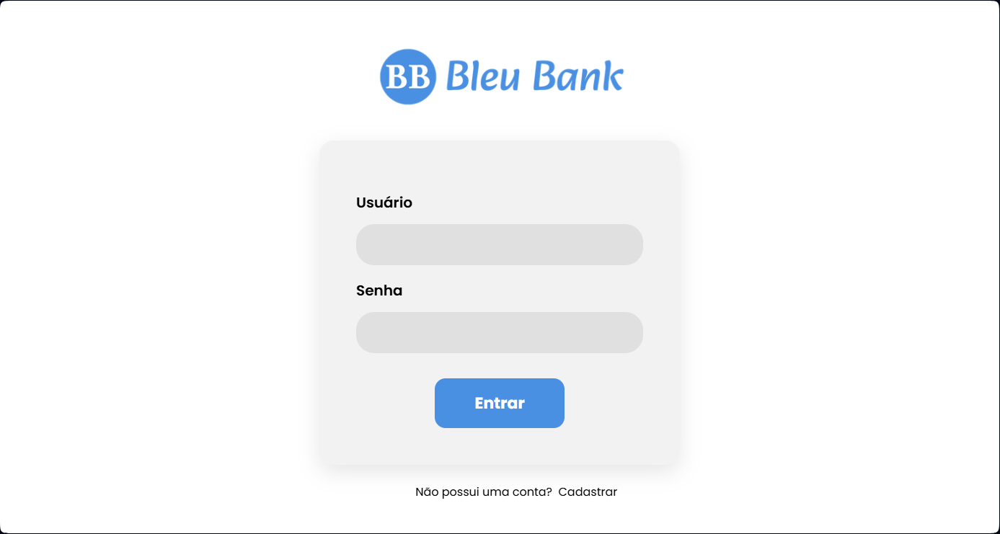
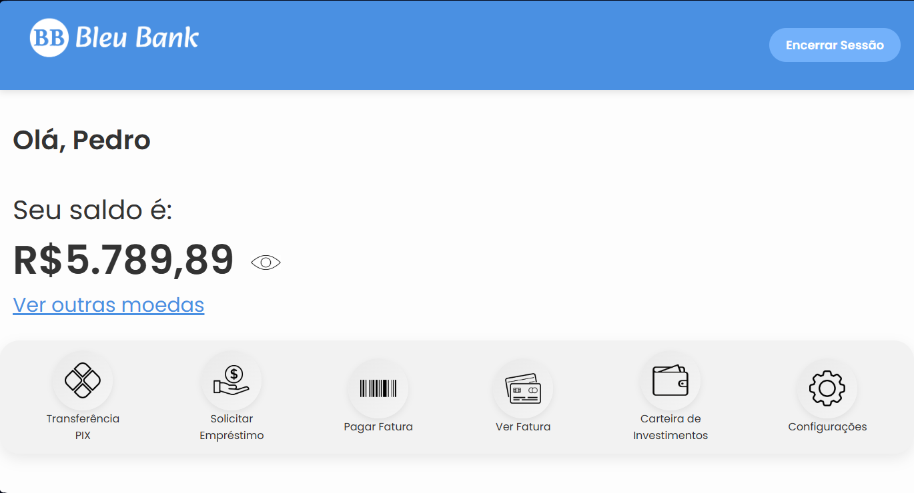

# Bleu-Bank
--- 
Este repositório contém uma aplicação que simula um **banco digital**, no qual as suas operações são realizadas via **chatbot do Whatsapp**, utilizando a API: https://github.com/pedroslopez/whatsapp-web.js para integração do chatbot e implementação de **pagamentos via qrcode** com a API: https://github.com/ceciliadeveza/gerarqrcodepix. A aplicação utiliza a biblioteca "pdfmake" para criação de comprovantes de pagamento. Os dados das transações são enviados através da plataforma de automação **Make** para uma planilha do **Google Sheets**, podendo ser consultadas posteriormente (este trecho de código pode ser alterado livremente no arquivo "script.js".

# Demonstração Visual 🔎

# Tecnologias Utilizadas 💻
- **HTML:** Estruturação do Web Chat
- **CSS:** Estilização do Web CHat
- **Python:** Linguagem utilizada para incialização do servidor e navegação por rotas
- **Javascript:** Linguagem de programação utilizada para construção da aplicação, integração da API de chatbot do Whatsapp e biblioteca **pdfmake**
- **Node.Js:** Inicialização da API do chatbot e instalação de bibliotecas utilizadas com JavaScript
- **SQLite:** Banco de dados utilizado para armazenamento do estado das conversas
- **Make:** Envio de dados de transferência automaticamente para uma planilha
- **Google Sheets:** Tabela de armazenamento de dados simples

# Pré-Requisitos ⚙
- Python instalado na máquina.
- Biblioteca Flask instalada.
- Instalação do terminal qrcode.
- Instalação da API de chatbot do Whatsapp.
- Instalação da biblioteca de integração do SQLite.
- Instalação da biblioteca "axios" para automação com o make.
- Instalação da biblioteca "pdfmake" para gerar comprovantes.

# GUIA DE UTILIZAÇÃO 📝
- Passo 1: Realizar a instalação do projeto na sua máquina e realizar o download de todas as bibliotecas necessárias.
- Passo 2: Gerar os links de whatsapp com o número que deseja inicar o chatbot, utilizando os textos condizentes com cada operação através do wa.link: https://criar.wa.link (exemplo: realizar uma transferência pix é chamada com o texto "Transferência PIX", que pode ser consultado no arquivo script.js linha 78, logo, o link gerado para essa operação deve ser o seu número de telefone para testes + o texto correspondente a operação) e substituir os links na página "início.html" com os gerados por você.
- Passo 3: Inicializar o projeto no terminal com "node script.js" e ler o qrcode com o número de testes do Whatsapp. Após a mensagem de conexão no terminal, começar os testes com as mensagens condizentes com cada operação na página "início.html"
- PASSOS ADICIONAIS E OPCIONAIS: A aplicação já funciona corretamente com a execução dos passos 1, 2 e 3, porém, para implementar a automatização de processamento de dados com a plataforma Make, basta gerar um ambiente com um "webhook" para tratar os dados, e criar uma planilha correspondente no Google Sheets para armazenar. Copie o seu link do webhook e cole na página "script.js" na linha 402.

# Link de Download 💾
A aplicação web pode ser baixada e testada, para implementação de melhorias ou fins educacionais através: [Deste Link](https://downgit.github.io/#/home?url=https://github.com/carlossant77/web-chat)

# Observações do autor 📚
(16/09/25) - O projeto ainda não foi hospedado para demonstração prática, entretanto, o seu link de download e manual de uso de encontra disponível acima. 

